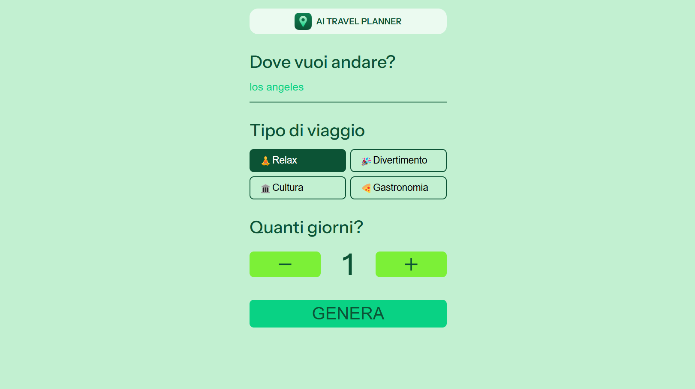
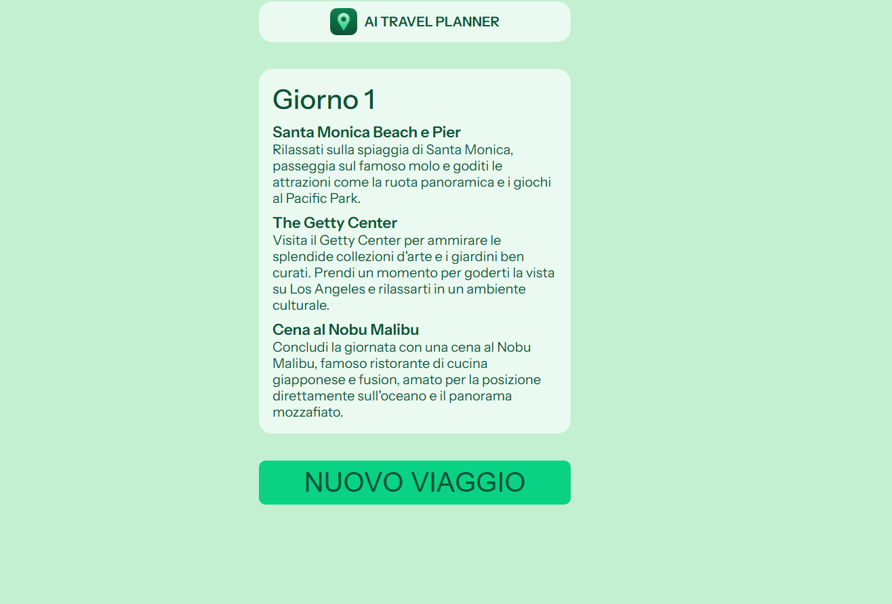
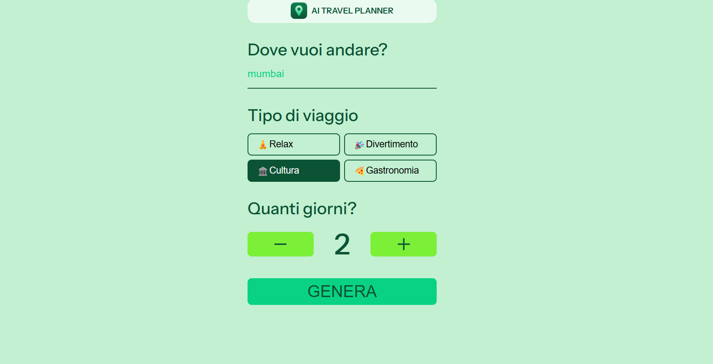
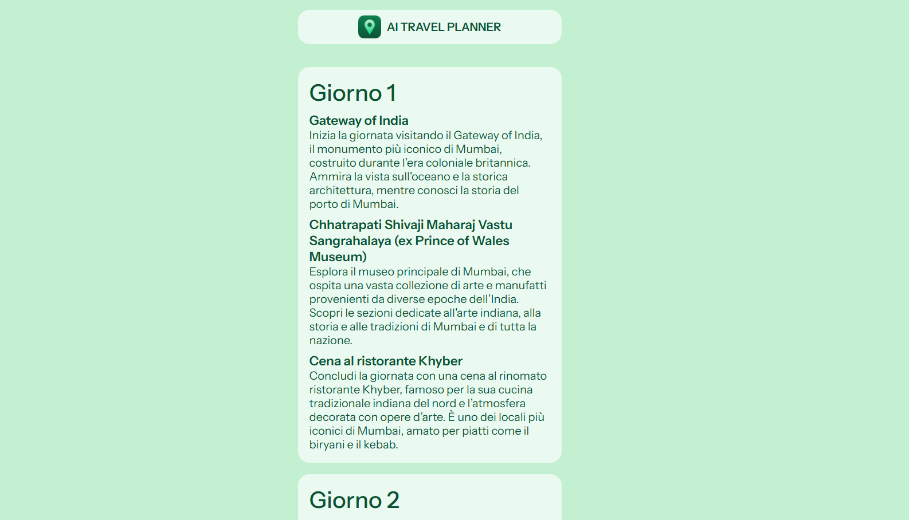
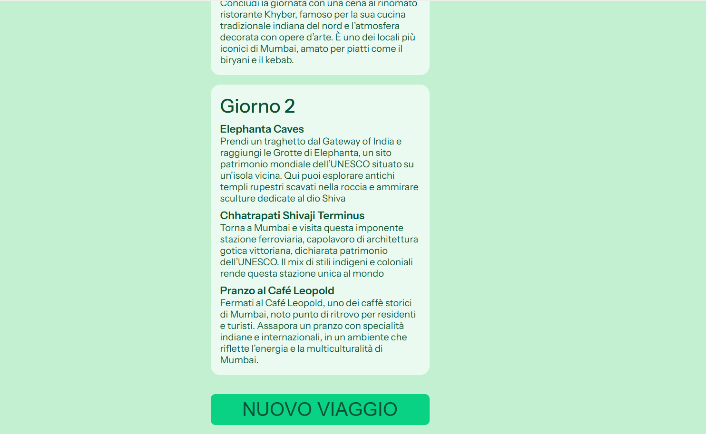
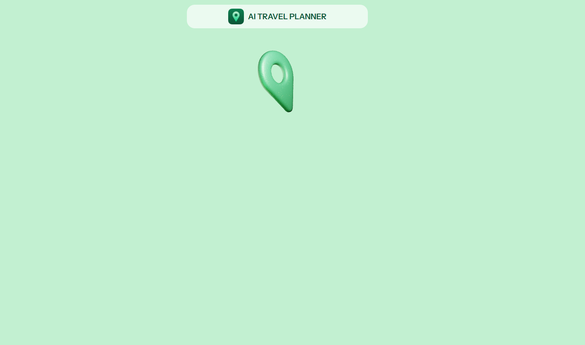

# Travel planner

Questo progetto è una piccola web app che genera itinerati con l'intelligenza artificiale in base alla meta, al tipo di viaggio che inserisci quindi: relax, divertimento ecc, e ai giorni.

## Descrizione

Questo progetto è stato realizzato con HTML, CSS, JavaScript, API

## Funzionalità

La web app include le seguenti funzionalità:

- generazione itinerari in base al pulsante cliccato
- loader

## Tecnologie utilizzate

La web app è stata sviluppata utilizzando le seguenti tecnologie:

- HTML
- CSS
- JavaScript
- API 

## Licenza

<!-- Questo progetto è stato rilasciato sotto la licenza MIT. Per ulteriori informazioni, leggere il file `LICENSE.md`. -->

## Crediti

Questo progetto è stato sviluppato da Katia Falletti.(https://it.linkedin.com/in/katia-falletti-616890225?trk=people-guest_people_search-card)
